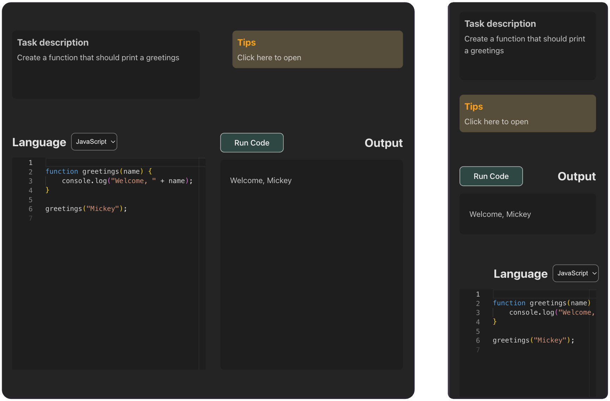

# Code Editor app

### Deploy on Vercel

https://task-code-editor.vercel.app/

## App description

The Code Editor App has next features:

- support 3 programming languages (Javascript, Go, Python)
- mock server (JSON Server) to execute user code
- Error Mode switching using UI
- adaptive and responsive for mobile devices

<div align="center">

</div>
<br>

## Stack:

- React + TS
- Vite
- Sass

## Installation and Running

1. Clone the repository

```bash
git clone https://github.com/Svetk0/task-code-editor.git
```

2. Move to project folder

```bash
 cd task-code-editor
```

3. Install all dependencies from `package.json`

```bash
npm install
```

4. If success RUN project

```bash
npm run fullstack
```

5. Check the local host on the port 7000 (server will be run on the port 7001 simultaneously) <br>

```bash
http://localhost:7000/ #copy and paste in the browser
```

## Upgrade Suggestions

1. Use a real API (like https://piston.readthedocs.io/en/latest/api-v2/)
2. Tips block should be updated according to Task block (relevant subjects and topics that need to solve the task)
3. Add more languages
